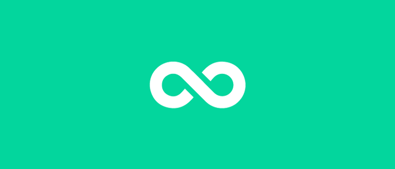

<div align="center">
    
</div>
<div align="center">
    <a href="https://github.com/Gustavo-Henrique-br" >
        
    </a>
    <a href="https://github.com/eoguvo/woovi-challenge/stargazers"></a>
</div>

# Woovi Junior Challenge

Challenge made by Woovi to junior roles.

## 🚀 Tech Stack

- [React](https://reactjs.org/)
- [TypeScript](https://www.typescriptlang.org/)
- [Vite](https://vitejs.dev/)
- [React Router](https://reactrouter.com/)
- [React Hook Form](https://react-hook-form.com/)
- [Material UI](https://mui.com/)
- [Recoil](https://recoiljs.org/)
- [Yup](https://github.com/jquense/yup)
- [Styled Components](https://styled-components.com/)

## 🎲 Running

> Before start, you need have installed in your machine:
[Git](https://git-scm.com), [Node.js (npm)](https://nodejs.org/en/).
> In addition, it is good to have an editor to work on the code, such as [VSCode](https://code.visualstudio.com/).

```bash
# clone the repository in your machine
$ git clone https://github.com/eoguvo/woovi-challenge.git

# Install the dependencies:
$ npm i

# Running in watch mode
$ npm run dev
```

# Todo:

- [X] Create the project
- [X] Crreate the layout
- [X] Create the payment method page
- [X] Create the payment pix page
- [X] Create the payment card page
- [X] Validate form with Yup
- [X] Create some toasts
- [ ] Tests
